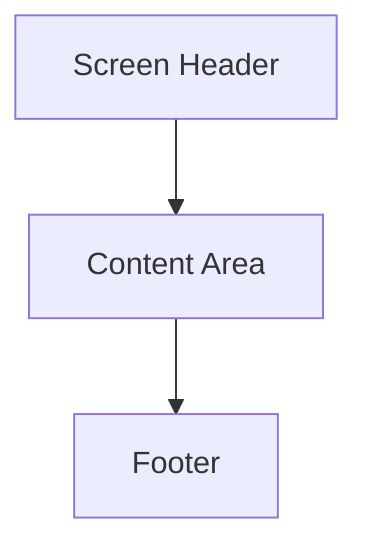

# Wireframe Image Generation Guide

## Overview

This guide explains how to convert the ASCII wireframes into visual wireframe images.

## Available Formats

### 1. Text Wireframes
- File: `wireframes_MarTech.txt`
- Simple text representation of wireframes

### 2. Detailed ASCII Wireframes
- File: `wireframes_detailed_MarTech.md`
- Detailed ASCII art wireframes with full layout

## Image Generation Options

### Option 1: Mermaid Diagrams
Convert ASCII wireframes to Mermaid flowcharts:

### Option 2: AI Image Generation
Use AI tools like:
- DALL-E / Midjourney: Describe the wireframe layout
- Stable Diffusion: Use ASCII wireframe as prompt
- ChatGPT / Claude: Request visual wireframe generation

### Option 3: Design Tools
Import ASCII wireframes into:
- Figma: Create frames based on ASCII layout
- Excalidraw: Draw wireframes manually
- Balsamiq: Use wireframe templates

### Option 4: Code-Based Generation
Use libraries like:
- Python: `matplotlib`, `PIL` for programmatic wireframes
- JavaScript: `D3.js`, `React` for interactive wireframes

## Next Steps

1. Review the detailed ASCII wireframes in `wireframes_detailed_{safe_domain}.md`
2. Choose your preferred image generation method
3. Generate visual wireframes based on the ASCII layouts
4. Save images in formats like PNG, SVG, or PDF

